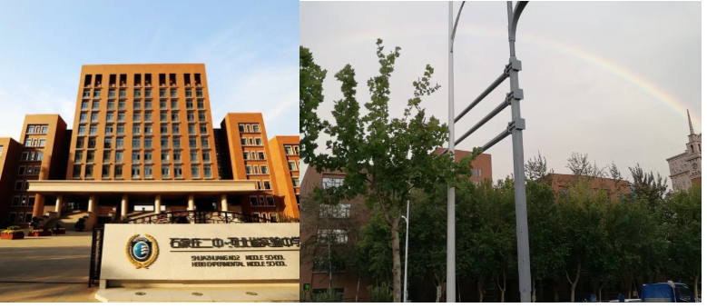
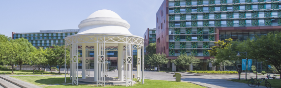

## About me

My name is Lu Yu, and I am a student in Applied Statistics with a focus on Biostatistics at Xi'an Jiaotong-Liverpool University (XJTLU).

Books have saved me a lot. Works like *The Lady Tasting Tea* revealed to me how statistics revolutionized science and how figures like Florence Nightingale used data visualization to improve healthcare—demonstrating that data is the measure of the world's intent. My learning is driven by the profound philosophical shift within statistics: from Laplace's "error function" reconciling prediction and observation, to the modern embrace of randomness as a structured entity describable by probability distributions. I am fascinated by the entire spectrum of thought, from the intuitive logic of classical methods like moment estimation to the iterative learning philosophy of Bayesian statistics, and the deep theoretical connections—such as how Maximum Likelihood Estimation equates to minimizing KL divergence.

The true joy comes from applying these concepts. Successfully fitting a mixture model via the EM algorithm, or freely employing Bayesian methods and dimensionality reduction techniques in mathematical modeling, allows me to feel both the power of theory and the vast space for creative application. My motivation is sustained through deep dialogue. I am profoundly grateful to my professors at XJTLU—the light in their eyes when recounting the history of statistics, and their patient guidance during countless office-hour conversations, have empowered me, an introvert by nature, to find deep fulfillment in walking others through logical derivations and statistical concepts. This process has reaffirmed my belief that "making those around you better is a greater achievement than individual prowess."

I once fell deeply for the beauty of pure mathematics and even questioned my choice of statistics. However, when I began applying my knowledge—when my understanding of linear regression deepened from matrix projections to its connections with machine learning and causal inference—I knew my path was right. Statistics, particularly biostatistics, allows me to wield centuries of intellectual development to address real-world problems in human health. The concept of approximation (limit / equation ) in pure math is akin to how causal inference aspires to approximate the "gold standard" of randomized trials: it teaches humility in the face of nature's complexity, not arrogance. Coming from Shijiazhuang, a major pharmaceutical hub, I now aspire to contribute to medical research through statistical models and coding skills. This purpose provides a solid foundation for all my passions, making the journey profoundly meaningful.

## Why do I like learning ,especially math related things?

Why do I like mathematical analysis so much? Is it because teachers really sophisticated in it so that tell stories well? Is it because I was always bored in my sophomore year and enjoyed seeking out problems, consulting teachers, and then chatting with them? Is it because I liked to use different counterexamples to view theorems but had to reluctantly accept the fact that I would never be able to come up with counterexamples myself? Is it because I enjoyed thinking about the same problem in various ways and marveled at the charm of scholarship? Is it because during the final exam, the Archimedean Property made 1/n fall within the delta of uniform continuity, and prove the result in the last second of the exam? Is it because I took pride in the intuitive drawing of sequence approximation, which allowed me to see the result at a glance before the proof? Or is it because I was amazed by the simple derivation of the volume of an n-dimensional sphere using recurrence iterated integrals? Is it because I realized that even the historically rigorous differential equations can only approximately describe nature, and thus I gladly accepted my own insignificance? Is it because I admired the teachers who, despite often being confused about the meaning of life, still resolutely pursued the path of applied and pure mathematics? Or is it because I was immersed in the little stories told by teachers that combined mathematical principles with life lessons, such as Minkowski, who, suffering from appendicitis and on his deathbed, lamented that he was dying in an era when the theory of relativity was being developed—compared to these stories, all regrets seemed to vanish.

Statistics is a beneficial and interesting subject and I feel so lucky to major in BioStatistics.

## edu

Thanks to - [NO.2 Middle School of Shijiazhuang.](https://www.sjzez.com/) I met many charismatic teachers here. Not only have my high school instilled in me the idea of active learning, but also provided a very comfortable learning environment. I really like the philosophy of my high school:

> 坚毅勤奋诚朴健美 Perseverance Diligence Integrity Fitness
>
> 

Thanks to - [Xi'an Jiaotong-Liverpool University](https://www.xjtlu.edu.cn/), I am trying to follow this philosophy with our university students under the guidance of kind and sophisticated teachers:

> To be lifelong learners and global citizens.
>
> 

-   [GitHub is a good way to push me forward every day](https://github.com/yuuuulu)