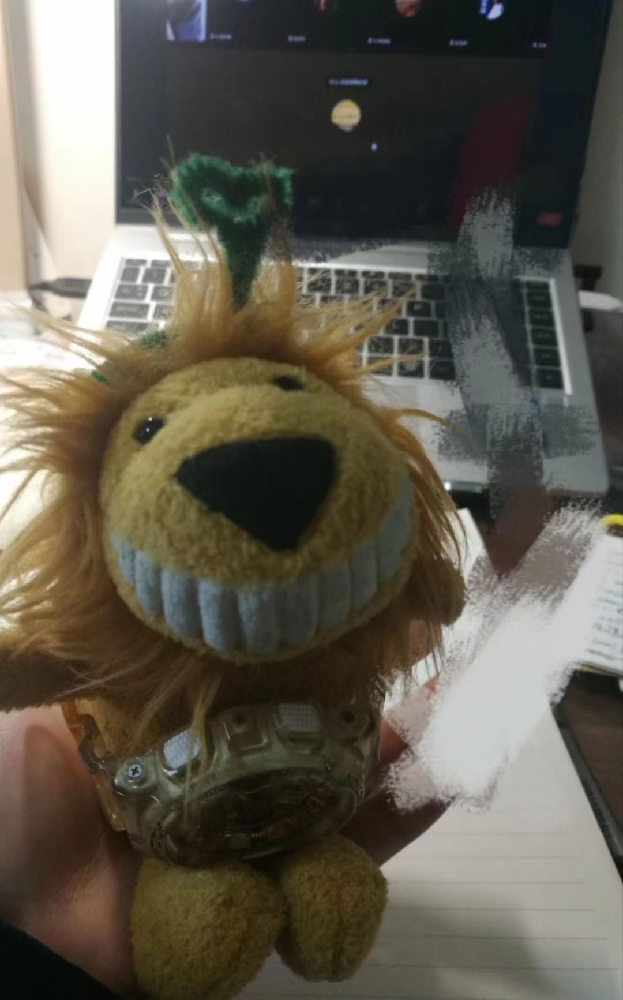

::: columns
::: {.column width="70%"}
$~$

Yu Lu, an Applied Statistics student focusing on biostatistics learning in School of Mathematics and Physics at Xi'an Jiaotong-Liverpool University. I am interested in
:::

::: {.column width="30%"}
{width="100%"}

:::
:::

### Current Progresses

Keep going for being "a person who can coax treasure out of messy, unstructured data" especially biological data.

$~$

$~$

+----------------------------------------+--------------------------------------+
| Contact Information:                   |                                      |
+:=======================================+======================================+
| XJTLU                                  | Tel: ...                             |
+----------------------------------------+--------------------------------------+
| Department of Mathematics and Physics  | Applied Statistics                   |
|                                        |                                      |
|                                        | (Biological Statistics)              |
+----------------------------------------+--------------------------------------+
| Xi'an Jiaotong-Liverpool University    | Email: Yu.Lu23\@student.xjtlu.edu.cn |
+----------------------------------------+--------------------------------------+
| Suzhou, JiangSu, China                 | Hometown: Hebei                      |
+----------------------------------------+--------------------------------------+

$~$

